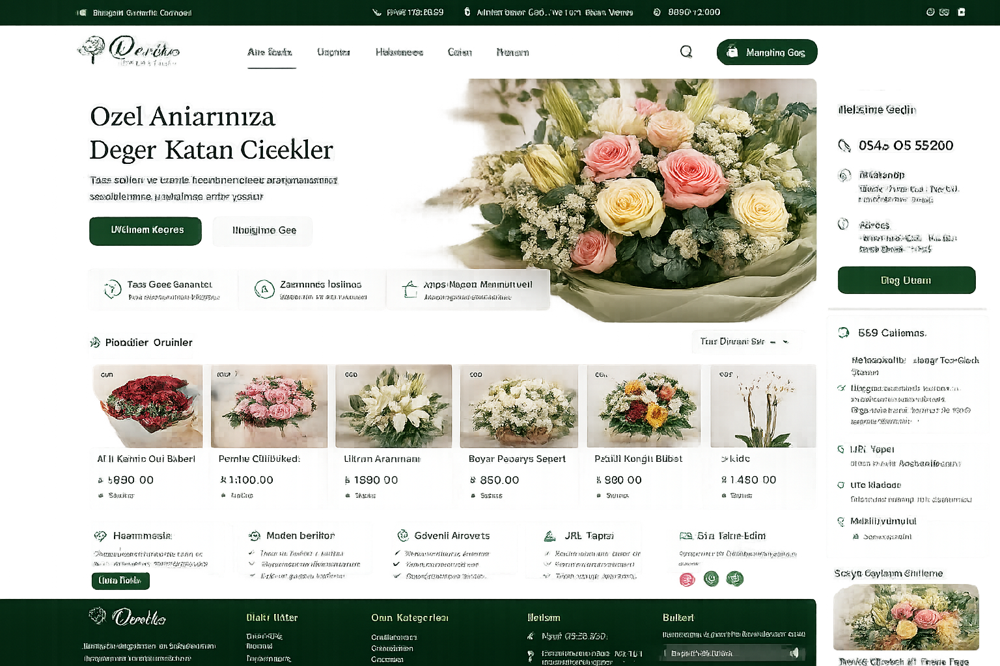

# 🌸 Deriko Çiçekçilik — Showcase

A sanitized portfolio/demo repository for a real-world florist website and internal stock-management project.

> **Important:** This repository is **not** the production source code. It contains a safe demo built with mock data only. Credentials, customer data, accounting records, server configuration and private business logic are intentionally excluded.

## Project Overview

The project combines:

- A customer-facing florist website
- Product and stock management
- Sequential product codes
- Sales records
- Basic income / expense tracking
- Employee and administrator workflows
- Notes / internal communication
- Mobile-friendly interfaces

## Demo

Open the files locally in a browser:

- `demo/index.html` — customer-facing storefront demo
- `demo/admin.html` — stock/admin dashboard demo

No backend, login credentials, API keys or database connection are required. All demo records are generated locally in the browser.

## Screenshots



## My Role

I worked across the project lifecycle, including:

- Requirements analysis
- UI / UX implementation
- Admin and employee workflows
- Stock and sales flows
- Testing and debugging
- Client revisions
- Deployment and live-environment work

## Live Website

https://derikocicekcilik.com

## Repository Structure

```text
deriko-cicekcilik-showcase/
├── README.md
├── demo/
│   ├── index.html
│   ├── admin.html
│   ├── styles.css
│   └── app.js
├── docs/
│   └── architecture.md
└── screenshots/
    └── homepage.png
```

## Privacy & Security

The production implementation remains private. This showcase intentionally contains:

- No `.env` file
- No database credentials
- No API keys
- No customer records
- No employee credentials
- No real accounting data

## Status

**Production project / public showcase demo**
